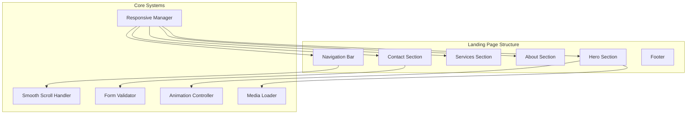

# Design Document: Lusk.cloud Landing Page

## Overview

This design document outlines the technical architecture and implementation approach for the Lusk.cloud landing page. The page will be built as a modern, single-page application featuring a sky/cloud-inspired visual theme. The implementation will use HTML5, CSS3 (with modern features like CSS Grid and Flexbox), and vanilla JavaScript for interactivity, ensuring fast load times and broad compatibility.

The design prioritizes:
- Visual impact through cloud-themed imagery and video backgrounds
- Smooth user experience with fluid animations and transitions
- Mobile-first responsive design
- Accessibility compliance
- Performance optimization for media-heavy content

## Architecture

The landing page follows a component-based architecture organized into distinct sections, each responsible for a specific part of the user experience.



### File Structure

```
lusk-cloud-landing-page/
├── index.html
├── css/
│   ├── styles.css
│   ├── components/
│   │   ├── navigation.css
│   │   ├── hero.css
│   │   ├── services.css
│   │   ├── about.css
│   │   ├── contact.css
│   │   └── footer.css
│   └── utilities/
│       ├── variables.css
│       ├── animations.css
│       └── responsive.css
├── js/
│   ├── main.js
│   ├── navigation.js
│   ├── form-validator.js
│   ├── smooth-scroll.js
│   └── animations.js
├── assets/
│   ├── images/
│   │   ├── logo.svg
│   │   ├── hero-clouds.webp
│   │   ├── hero-fallback.jpg
│   │   └── service-icons/
│   └── videos/
│       └── cloud-background.mp4
└── README.md
```

## Components and Interfaces

### Navigation Component

The navigation bar provides site-wide navigation with responsive behavior.

```
Interface NavigationConfig:
    logo: ImageSource
    links: Array<NavLink>
    stickyThreshold: Number (pixels from top to trigger sticky)
    mobileBreakpoint: Number (viewport width for mobile menu)

Interface NavLink:
    label: String
    targetSection: String (section ID)
    
Function initNavigation(config: NavigationConfig):
    - Render navigation bar with logo and links
    - Attach scroll listener for sticky behavior
    - Attach click listeners for smooth scrolling
    - Initialize mobile menu toggle

Function toggleMobileMenu():
    - Toggle menu visibility
    - Animate menu expansion/collapse
    - Update aria-expanded attribute
```

### Hero Section Component

The hero section creates the first impression with impactful visuals.

```
Interface HeroConfig:
    headline: String
    subheadline: String
    ctaButtons: Array<CTAButton>
    backgroundType: "video" | "image"
    backgroundSource: String
    fallbackImage: String

Interface CTAButton:
    text: String
    href: String
    style: "primary" | "secondary"

Function initHero(config: HeroConfig):
    - Load background media (video or image)
    - Render headline and subheadline with fade-in animation
    - Render CTA buttons
    - Apply text shadow/overlay for readability
```

### Services Section Component

Displays the consultancy's service offerings in an engaging grid layout.

```
Interface Service:
    id: String
    title: String
    description: String
    icon: String (SVG path or icon class)

Interface ServicesConfig:
    services: Array<Service>
    columns: Number (grid columns for desktop)

Function initServices(config: ServicesConfig):
    - Render service cards in grid layout
    - Apply hover animations
    - Ensure consistent card heights
```

### Contact Form Component

Handles user inquiries with validation.

```
Interface FormField:
    name: String
    type: "text" | "email" | "textarea"
    label: String
    required: Boolean
    validation: ValidationRule

Interface ValidationRule:
    pattern: RegExp (optional)
    minLength: Number (optional)
    maxLength: Number (optional)
    errorMessage: String

Interface FormConfig:
    fields: Array<FormField>
    submitEndpoint: String
    successMessage: String

Function initContactForm(config: FormConfig):
    - Render form fields
    - Attach validation listeners
    - Handle form submission

Function validateField(field: FormField, value: String) -> ValidationResult:
    - Check required constraint
    - Check pattern match (if applicable)
    - Check length constraints
    - Return validation result with error message if invalid

Function validateEmail(email: String) -> Boolean:
    - Check email format using regex pattern
    - Return true if valid, false otherwise

Function submitForm(formData: Object) -> Promise<SubmissionResult>:
    - Validate all fields
    - If valid, submit to endpoint
    - Return success/failure result
```

### Smooth Scroll Handler

Manages smooth scrolling navigation.

```
Function smoothScrollTo(targetId: String, offset: Number):
    - Get target element position
    - Calculate scroll position with offset for sticky nav
    - Animate scroll using requestAnimationFrame
    - Update URL hash without jumping

Function initSmoothScroll(navLinks: NodeList):
    - Attach click listeners to all nav links
    - Prevent default anchor behavior
    - Call smoothScrollTo with target section
```

### Animation Controller

Manages scroll-triggered and hover animations.

```
Interface AnimationConfig:
    elements: String (CSS selector)
    animationClass: String
    threshold: Number (0-1, visibility threshold)
    once: Boolean (animate only once)

Function initScrollAnimations(configs: Array<AnimationConfig>):
    - Create IntersectionObserver for each config
    - Add animation class when element enters viewport
    - Remove class on exit if not "once"

Function initHoverAnimations():
    - Apply CSS transitions for interactive elements
    - Handle service card hover effects
```

## Data Models

### Navigation Data

```
NavigationData:
    logo:
        src: "/assets/images/logo.svg"
        alt: "Lusk.cloud"
        width: 150
    links:
        - label: "Home", target: "#hero"
        - label: "Services", target: "#services"
        - label: "About", target: "#about"
        - label: "Contact", target: "#contact"
```

### Services Data

```
ServicesData:
    services:
        - id: "web-strategy"
          title: "Web Strategy"
          description: "Comprehensive digital strategy to elevate your online presence and reach your target audience effectively."
          icon: "strategy-icon"
        
        - id: "site-optimization"
          title: "Site Optimization"
          description: "Performance tuning, SEO optimization, and user experience improvements to maximize your website's potential."
          icon: "optimization-icon"
        
        - id: "cloud-solutions"
          title: "Cloud Solutions"
          description: "Scalable cloud infrastructure and migration services to future-proof your digital operations."
          icon: "cloud-icon"
        
        - id: "ongoing-support"
          title: "Ongoing Support"
          description: "Dedicated maintenance and support to keep your web presence running smoothly around the clock."
          icon: "support-icon"
```

### Contact Form Data

```
ContactFormData:
    fields:
        - name: "name"
          type: "text"
          label: "Your Name"
          required: true
          validation:
              minLength: 2
              maxLength: 100
              errorMessage: "Please enter your name (2-100 characters)"
        
        - name: "email"
          type: "email"
          label: "Email Address"
          required: true
          validation:
              pattern: "^[^\s@]+@[^\s@]+\.[^\s@]+$"
              errorMessage: "Please enter a valid email address"
        
        - name: "message"
          type: "textarea"
          label: "Your Message"
          required: true
          validation:
              minLength: 10
              maxLength: 1000
              errorMessage: "Please enter a message (10-1000 characters)"
```

### Theme Configuration

```
ThemeConfig:
    colors:
        primary: "#0EA5E9"        // Sky blue
        primaryDark: "#0284C7"    // Deeper sky blue
        secondary: "#F0F9FF"      // Light cloud white
        accent: "#38BDF8"         // Bright sky accent
        text: "#1E293B"           // Dark slate for readability
        textLight: "#64748B"      // Muted text
        white: "#FFFFFF"
        overlay: "rgba(0, 0, 0, 0.4)"  // For text readability on video
    
    typography:
        fontFamily: "'Inter', 'Segoe UI', sans-serif"
        headingFamily: "'Poppins', 'Inter', sans-serif"
        baseFontSize: "16px"
        lineHeight: 1.6
    
    spacing:
        sectionPadding: "80px"
        containerMaxWidth: "1200px"
        cardGap: "24px"
    
    breakpoints:
        mobile: "480px"
        tablet: "768px"
        desktop: "1024px"
        wide: "1280px"
    
    animations:
        duration: "0.3s"
        easing: "cubic-bezier(0.4, 0, 0.2, 1)"
        floatDuration: "6s"
```


## Correctness Properties

*A property is a characteristic or behavior that should hold true across all valid executions of a system—essentially, a formal statement about what the system should do. Properties serve as the bridge between human-readable specifications and machine-verifiable correctness guarantees.*

Based on the prework analysis of acceptance criteria, the following properties have been identified for property-based testing:

### Property 1: Color Contrast Accessibility

*For any* text element displayed on the landing page, the contrast ratio between the text color and its background color SHALL meet WCAG AA standards (minimum 4.5:1 for normal text, 3:1 for large text).

**Validates: Requirements 1.6, 8.4**

### Property 2: Sticky Navigation Persistence

*For any* scroll position beyond the sticky threshold, the navigation bar SHALL remain visible within the viewport and maintain its position at the top of the screen.

**Validates: Requirements 2.2**

### Property 3: Navigation Link Targeting

*For any* navigation link clicked, the page SHALL scroll to position the corresponding target section within the visible viewport, accounting for the sticky header offset.

**Validates: Requirements 2.3**

### Property 4: Service Card Completeness

*For any* service card rendered in the services section, the card SHALL contain a non-empty title element, a non-empty description element, and a visible icon element.

**Validates: Requirements 3.2**

### Property 5: Form Validation Correctness

*For any* form submission attempt, the Form_Validator SHALL accept the submission if and only if all required fields contain valid data according to their validation rules, and SHALL display appropriate error messages for each invalid field when validation fails.

**Validates: Requirements 5.3, 5.4, 5.5**

### Property 6: Email Format Validation

*For any* string input to the email field, the Form_Validator SHALL return valid only if the string matches the pattern of a valid email address (contains exactly one @ symbol, has characters before and after @, and has a domain with at least one dot).

**Validates: Requirements 5.6**

### Property 7: Image Aspect Ratio Preservation

*For any* image displayed at any viewport width, the image's rendered aspect ratio SHALL remain equal to its intrinsic aspect ratio (no distortion).

**Validates: Requirements 6.4**

### Property 8: Image Accessibility

*For any* img element rendered on the landing page, the element SHALL have a non-empty alt attribute providing meaningful description of the image content.

**Validates: Requirements 8.2**

### Property 9: Keyboard Accessibility

*For any* interactive element (buttons, links, form inputs) on the landing page, the element SHALL be focusable via keyboard navigation and SHALL respond to keyboard activation (Enter/Space keys as appropriate).

**Validates: Requirements 8.3**

## Error Handling

### Form Validation Errors

| Error Condition | User Feedback | Recovery Action |
|----------------|---------------|-----------------|
| Empty required field | Red border on field, error message below field | Focus on first invalid field |
| Invalid email format | "Please enter a valid email address" | Highlight email field |
| Message too short | "Message must be at least 10 characters" | Show character count |
| Message too long | "Message cannot exceed 1000 characters" | Prevent further input |
| Form submission failure | "Unable to send message. Please try again." | Enable retry button |

### Media Loading Errors

| Error Condition | Fallback Behavior |
|----------------|-------------------|
| Video fails to load | Display static fallback image |
| Image fails to load | Display placeholder with alt text |
| Font fails to load | Fall back to system font stack |

### JavaScript Errors

| Error Condition | Graceful Degradation |
|----------------|---------------------|
| Smooth scroll unavailable | Use native anchor navigation |
| IntersectionObserver unsupported | Show all animations immediately |
| Form validation JS fails | Rely on HTML5 native validation |

### Network Errors

```
Function handleNetworkError(error: Error, context: String):
    - Log error for debugging
    - Display user-friendly message
    - Offer retry option where applicable
    - Maintain page functionality without network features
```

## Testing Strategy

### Unit Testing

Unit tests will verify specific examples, edge cases, and error conditions using Jest.

**Navigation Tests:**
- Logo renders with correct src and alt
- All navigation links render with correct labels
- Mobile menu toggle changes visibility state
- Sticky class applied after scroll threshold

**Form Validation Tests:**
- Valid name accepted (edge: minimum 2 characters)
- Invalid name rejected (edge: 1 character, empty)
- Valid email formats accepted
- Invalid email formats rejected (missing @, missing domain, etc.)
- Valid message accepted (edge: exactly 10 characters)
- Invalid message rejected (edge: 9 characters, empty)
- Success message displayed on valid submission
- Error messages displayed for each invalid field

**Responsive Tests:**
- Hamburger menu visible at mobile breakpoint
- Full nav visible at desktop breakpoint
- Service cards stack on mobile
- Video replaced with image on mobile

### Property-Based Testing

Property-based tests will use fast-check library to verify universal properties across generated inputs. Each test will run minimum 100 iterations.

**Test Configuration:**
```javascript
// fast-check configuration
const fcConfig = {
  numRuns: 100,
  verbose: true
};
```

**Property Test Implementations:**

```javascript
// Feature: lusk-cloud-landing-page, Property 1: Color Contrast Accessibility
// For any text/background color pair, contrast ratio meets WCAG AA

// Feature: lusk-cloud-landing-page, Property 5: Form Validation Correctness
// For any form data, validation accepts iff all fields valid

// Feature: lusk-cloud-landing-page, Property 6: Email Format Validation
// For any string, email validation correctly identifies valid/invalid

// Feature: lusk-cloud-landing-page, Property 8: Image Accessibility
// For any image element, alt attribute is non-empty
```

### Integration Testing

Integration tests will verify component interactions using Playwright.

**Scenarios:**
- Full page load and render
- Navigation click scrolls to correct section
- Form submission flow (valid and invalid)
- Responsive layout transitions
- Video/image fallback behavior

### Accessibility Testing

- Automated: axe-core integration for WCAG compliance
- Manual: Keyboard navigation walkthrough
- Screen reader testing with NVDA/VoiceOver

### Performance Testing

- Lighthouse CI for performance metrics
- Target: Performance score > 90
- Target: First Contentful Paint < 1.5s
- Target: Largest Contentful Paint < 2.5s
